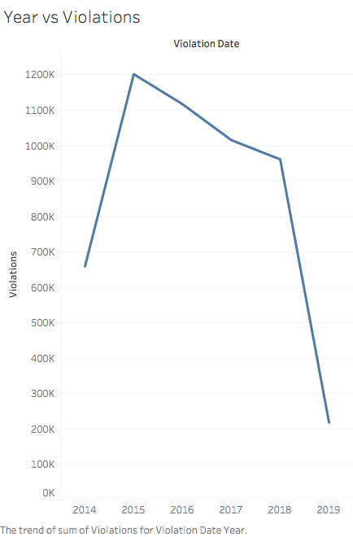
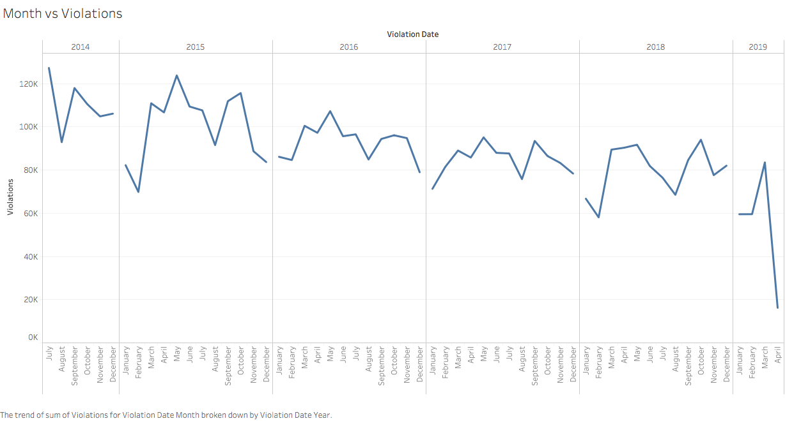
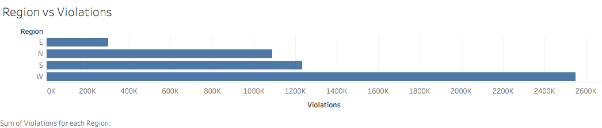
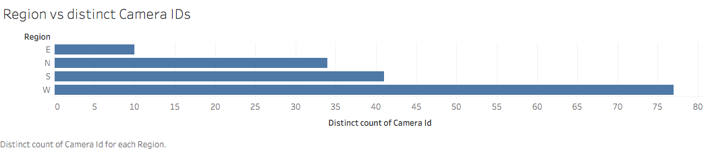
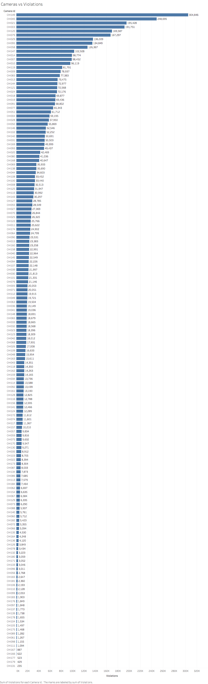
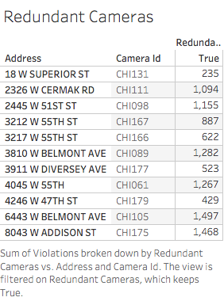
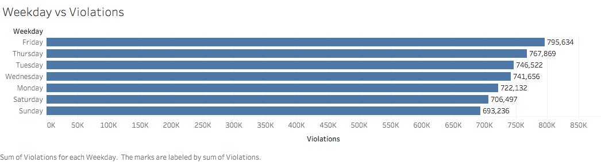
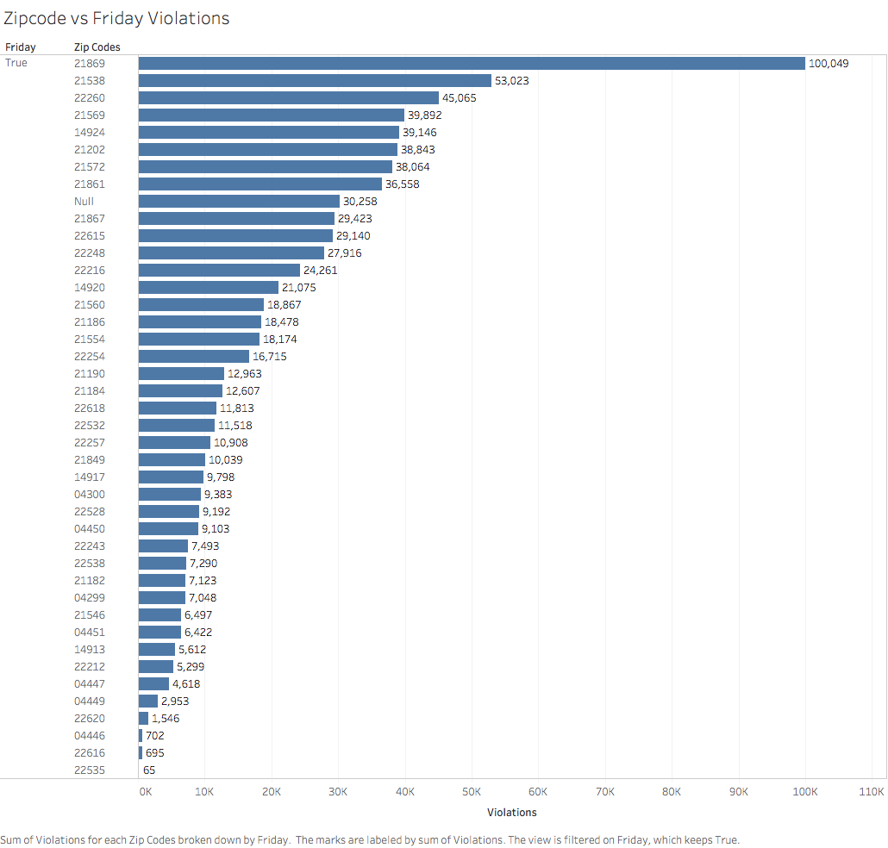

# Data-Viz-Individual-Project

## Introduction

A dataset on Chicago speed violations has been analyzed to find some interesting insights. The dataset includes daily volume of violations that have occurred in Children's Safety Zones for each camera in Chicago from July,14 to present. 

## Visualization 1
While starting to visualize, the first thing to see was to check whether there has been any reductions in the number of violations after installation of the cameras. On plotting a line graph, it was seen that there was a drastic increase from 2014 to 2015 which was later understood to be present because of the fact that the data of 2014 was incomplete and only data for months from July to December were incorporated. 

So, a separate graph that showed graph of months vs violations was plotted which showed a gradual decline in the number of total violations. This shows that the camera installation program has proved to be a success. 

## Visualization 2
After understanding that the violations are dropping after the installation of cameras in 2014, it felt important to check the trend of number of violations in each region(N, S, E, W) and the number of cameras in that region. So, the address field was ‘split’ and another column was created that showed the specific region in Chicago (N, S, E, W). On plotting these two bar graphs, it was seen that the trend of region vs the number of violations and region vs number of cameras in that region was identical.  The number of cameras vs region was plotted by considering Count Distinct in the camera id field.

The second thought that came in mind was to find whether all the cameras have registered almost the same number of violations over these years. If not, is the difference between the violations huge for few cameras. When the data was put into graphs, it was found that there were cameras that had registered violation in lacs and many others that had registered violations in hundreds. This suggested that putting cameras where violations are so less is redundant and we can put these cameras to better use by putting them at other locations. A list of camera IDS along with their addresses have been created where the number of violations are less than 1500.  This was calculated by creating a calculated field and putting the formula sum(violations)<1500. This helped in creating a new column ‘Redundant Cameras’ which was then plotted against ‘Camera ID’. The true portion of the ‘Redundant Camera’ was selected by clicking on ‘Keep Only’ and this is how the list was created.

## Visualization 3
The third most important thing to analyze was to find whether there is any particular day where violations is the most. For this a separated column called weekday was added by creating a calculated field and using the datetime function. This helped us to know that the most violations happen on Friday so, more police officers should be put on surveillance on Fridays as compared to the other days. The usual thought process is that the most violations must be occurring on weekdays from Monday to Thursday since people would be in a hurry to reach office on time and a little low on Fridays since people work from home on Fridays but the visualizations show otherwise.

## Roadmap
Currently, only one dataset has been analyzed. This dataset includes daily volume of violations that have occurred in Children's Safety Zones for each camera in Chicago from July,14 to present. For the second version of this project, I would try to find some new datasets, merge it with this existing one and try to find some more exciting insights.
