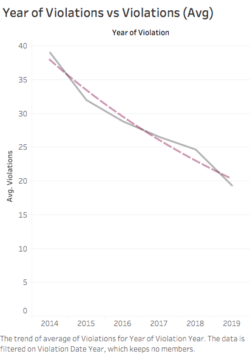

# Data-Viz-Individual-Project

## Introduction

A dataset on Chicago speed violations has been analyzed to find some interesting insights. The dataset includes daily volume of violations that have occurred in Children's Safety Zones for each camera in Chicago from July,14 to present. 

## Visualization 1
The most important thing after launching a program is to know whether it proved to be successful. So, the first thing to check is to see if the number of violations has decreased over the years after the installation of the cameras. The first chart that I prepared was a plot of number of violations vs year of violation, but this chart is not correct since the data for 2014 and 2019 is not for the whole year. Hence, chart of average violations vs year has been plotted. To properly show the decrease in violations, trend line was used which clearly shows the decreasing trend. This proves that the program was a success. Title has been boldened. Trend line has been formatted to show color different from actual graph line.

Both these graphs have been shown on a dashboard.

## Visualization 2
After understanding that the violations are dropping after the installation of cameras in 2014, it felt important to check the trend of number of violations in each region (N, S, E, W) and the number of cameras in that region. So, the address field was ‘split’ and another column was created that showed the specific region in Chicago (N, S, E, W). The values N, S, E,W has been changed to North, South, East, West using ‘Case’ function in calculated field.

The second thought that came in mind was to find whether all the cameras have registered almost the same number of violations over these years. If not, is the difference between the violations huge for few cameras. When the data was put into graphs, it was found that there were cameras that had registered violation in lacs and many others that had registered violations in hundreds. A calculated field has been created to segment the cameras on the basis of the sum of all violations it has registered from July,14 to present. An if else function has been written in the calculated field to generate these colors. The graph has been sorted in descending order of the number of violations per camera.

This suggested that putting cameras where violations are so less is redundant and we can put these cameras to better use by putting them at other locations. A list of camera IDS along with their addresses have been created where the number of violations is less than 5000. This was plotted by putting a filter on the sum of violations. The titles have been boldened.

## Visualization 3
The third most important thing to analyze was to find whether there is any particular day where violations is the most. For this a separated column called weekday was added by creating a calculated field and using the datetime function. This helped us to know that the most violations happen on Friday so, more police officers should be put on surveillance on Fridays as compared to the other days. The usual thought process is that the most violations must be occurring on weekdays from Monday to Thursday since people would be in a hurry to reach office on time and a little low on Fridays since people work from home on Fridays but the visualizations show otherwise.

